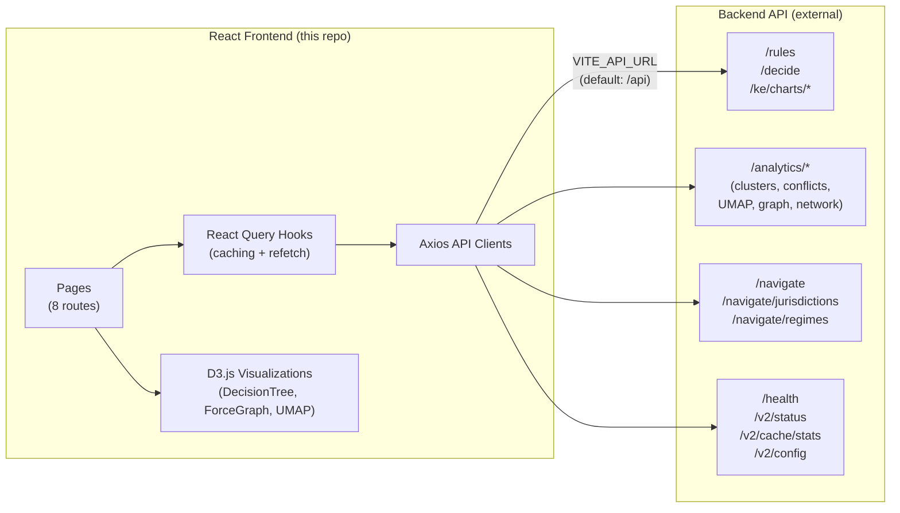
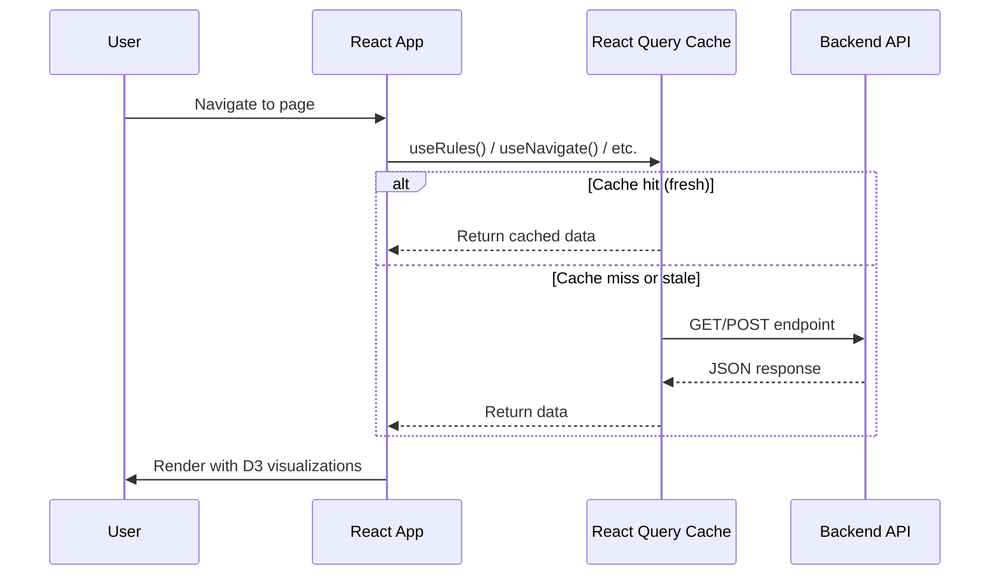

# Applied AI Regulatory Workbench

A React frontend for exploring and analyzing financial regulations encoded as executable logic. Covers MiCA, stablecoin frameworks, and RWA tokenization — with interactive D3.js visualizations, cross-border compliance navigation, and ML-powered similarity search.

**Live Demo:** [main.d3mr08v2x8u79p.amplifyapp.com](https://main.d3mr08v2x8u79p.amplifyapp.com)

## Features

| Feature | Capability |
|---------|------------|
| **Rule Browser** | Browse rules, visualize decision trees, run trace tests |
| **Navigator** | Cross-border compliance pathways with conflict detection |
| **Similarity Search** | Find related rules across jurisdictions using vector similarity |
| **Analytics** | Rule clustering, UMAP projections, coverage gaps, conflict resolution |
| **Graph Visualizer** | Force-directed rule dependency and network graphs |
| **Production Monitor** | Health checks, cache stats, database metrics |

## Architecture



The React app consumes an external backend API via the `VITE_API_URL` environment variable. In production, requests are proxied through nginx to `/api`.

## Backend Services

The frontend calls four groups of backend API endpoints:

### Rules & Decision Engine

| Method | Endpoint | Purpose |
|--------|----------|---------|
| GET | `/rules` | List all rules |
| GET | `/rules/{id}` | Rule detail |
| GET | `/rules/{id}/versions` | Version history |
| GET | `/rules/{id}/events` | Audit trail |
| POST | `/decide` | Execute decision engine with scenario input |
| GET | `/ke/charts/decision-tree/{id}` | Decision tree visualization data |

### Analytics & Similarity

| Method | Endpoint | Purpose |
|--------|----------|---------|
| POST | `/analytics/rules/compare` | Compare two rules |
| POST | `/analytics/rule-clusters` | Cluster rules by similarity |
| POST | `/analytics/find-conflicts` | Detect conflicting rules |
| GET | `/analytics/rules/{id}/similar` | Find similar rules (embedding_type, top_k, min_score) |
| GET | `/analytics/coverage` | Coverage report |
| POST | `/analytics/umap-projection` | UMAP dimensionality reduction |
| GET | `/analytics/graph/{id}` | Rule dependency graph |
| GET | `/analytics/network` | Network graph (min_similarity) |

### Cross-Border Jurisdiction

| Method | Endpoint | Purpose |
|--------|----------|---------|
| POST | `/navigate` | Cross-border compliance navigation (pathway, obligations, conflicts) |
| GET | `/navigate/jurisdictions` | List available jurisdictions |
| GET | `/navigate/regimes` | List regulatory regimes |
| GET | `/navigate/equivalences` | Regulatory equivalence determinations |

### Health & Monitoring

| Method | Endpoint | Purpose |
|--------|----------|---------|
| GET | `/health` | Service health status |
| GET | `/v2/status` | Database statistics |
| GET | `/v2/cache/stats` | IR cache statistics |
| GET | `/v2/config` | System configuration and feature flags |

## Data Flow



## Project Structure

```
frontend-react/              # React 18 + TypeScript + D3.js
├── src/
│   ├── api/                 # Axios clients (rules, analytics, jurisdiction, production)
│   ├── types/               # TypeScript types
│   ├── hooks/               # React Query hooks with caching
│   ├── store/               # Zustand state management
│   ├── pages/               # 8 page components
│   │   ├── Home.tsx
│   │   ├── KEWorkbench.tsx
│   │   ├── ProductionDemo.tsx
│   │   ├── CrossBorderNavigator.tsx
│   │   ├── EmbeddingExplorer.tsx
│   │   ├── SimilaritySearch.tsx
│   │   ├── GraphVisualizer.tsx
│   │   └── AnalyticsDashboard.tsx
│   └── components/
│       ├── common/          # Shared UI components
│       └── visualizations/  # D3.js (DecisionTree, ForceGraph, UMAPScatter)
├── Dockerfile               # Nginx-based production image
├── nginx.conf               # Reverse proxy config (/api -> backend)
├── package.json
└── vite.config.ts

kube/                        # Kubernetes manifests (frontend only)
├── base/frontend/           # Deployment, Service, HPA
└── overlays/                # dev, local, prod

.github/workflows/           # CI/CD
├── ci.yml                   # Lint, test, type-check, Docker build
├── cd-staging.yml           # Auto-deploy frontend to staging
└── cd-production.yml        # Manual production deploy with approval gate
```

## Quick Start

```bash
cd frontend-react
npm install
npm run dev          # http://localhost:5173
```

Set `VITE_API_URL` to point at a running backend instance, or use the default `/api` proxy.

## Regulatory Frameworks

| Framework | Jurisdiction | Status |
|-----------|--------------|--------|
| **MiCA** | EU | Enacted (2023/1114) |
| **FCA Crypto** | UK | Enacted (COBS 4.12A) |
| **GENIUS Act** | US | Enacted (July 2025) |
| **SEC Securities** | US_SEC | Securities Act 1933 |
| **CFTC Digital Assets** | US_CFTC | CFTC 2024 framework |
| **FINMA DLT** | Switzerland | Enacted (DLT Act 2021) |
| **MAS PSA** | Singapore | Enacted (PSA 2019) |
| **SFC VASP** | Hong Kong | VASP regime 2023 |
| **PSA Japan** | Japan | Payment Services Act 2023 |

## Deployment

| Component | Platform | URL |
|-----------|----------|-----|
| **Frontend** | AWS Amplify | [main.d3mr08v2x8u79p.amplifyapp.com](https://main.d3mr08v2x8u79p.amplifyapp.com) |
| **Backend API** | AWS EKS | Separate repository |

See [EKS Deployment Strategy](docs/EKS%20Deployment%20Strategy%20with%20Optimal%20Kubernetes%20Use.md) for the full AWS deployment guide.

## CI/CD Pipeline

| Workflow | Trigger | Purpose |
|----------|---------|---------|
| `ci.yml` | PR, Push | Lint, tests, type checking, Docker build |
| `cd-staging.yml` | Push to main | Auto-deploy to staging with smoke tests |
| `cd-production.yml` | Manual | Production deploy with approval gate and rollback |

## Disclaimer

Research/demo project, not legal advice. Rules are interpretive models — consult qualified legal counsel for compliance decisions.

## License

MIT License. See [LICENSE](LICENSE).

---

Built with [Claude Code](https://claude.ai/code)
