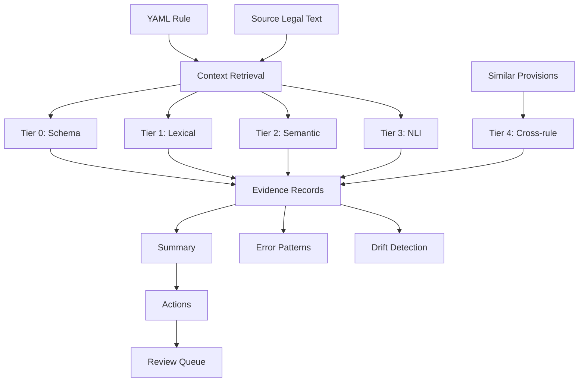

# Semantic Consistency for Regulatory Knowledge Graphs

This document specifies the semantic consistency and QA framework for validating rule annotations against their source legal text. It defines verification tiers, evidence structures, and the integration with the rule DSL.

## Overview

Regulatory rules encode human interpretations of legal text. These interpretations can be:
- **Correct**: The rule faithfully represents the legal provision
- **Incomplete**: The rule omits conditions or exceptions present in the text
- **Inconsistent**: The rule contradicts or misrepresents the source text
- **Ambiguous**: The rule interpretation is defensible but not uniquely correct

The semantic consistency layer provides automated QA to detect potential issues and prioritize human review.

## Architecture



### Verification Flow

1. **Input**: A YAML rule and its source legal text are provided
2. **RAG Layer**: Retrieves source context and finds similar provisions for cross-rule checks
3. **Tiered Verification**: Each tier runs progressively deeper checks
   - Tier 0-1: Deterministic, fast (<100ms), always run
   - Tier 2-4: ML-based, on-demand, require optional dependencies
4. **Evidence Collection**: Each check produces a labeled evidence record with score
5. **Summary Computation**: Aggregate evidence into overall status and confidence
6. **Analytics**: Feed results into error pattern analysis, drift detection, and review queue

## Consistency Block in Rule DSL

Every rule may include a `consistency` block that records verification results:

```yaml
rule_id: mica_art36_public_offer_authorization
# ... other fields ...

consistency:
  summary:
    status: verified | needs_review | inconsistent | unverified
    confidence: 0.0-1.0
    last_verified: "2024-12-10T14:30:00Z"
    verified_by: "system" | "human:username"
    notes: "Optional reviewer notes"

  evidence:
    - tier: 0  # Schema/structural check
      category: schema_valid
      label: pass | fail | warning
      score: 1.0
      details: "All required fields present"
      timestamp: "2024-12-10T14:30:00Z"

    - tier: 1  # Lexical/heuristic check
      category: deontic_alignment
      label: pass | warning
      score: 0.85
      details: "Obligation verb 'must' found in source, rule encodes requirement"
      source_span: "shall make a public offer"
      rule_element: "applies_if.all[0]"
      timestamp: "2024-12-10T14:30:01Z"
```

## Verification Tiers

### Tier 0: Schema & Structural Validation

Deterministic checks on rule structure:

| Check | Description | Label |
|-------|-------------|-------|
| `schema_valid` | Rule parses against DSL schema | pass/fail |
| `required_fields` | All required fields present (rule_id, source) | pass/fail |
| `source_exists` | Source document/article can be resolved | pass/fail/warning |
| `cross_refs_valid` | Referenced rules/provisions exist | pass/fail/warning |
| `date_consistency` | effective_from <= effective_to | pass/fail |
| `id_format` | rule_id follows naming convention | pass/warning |

### Tier 1: Lexical & Heuristic Analysis

Surface-level text analysis without embeddings:

| Check | Description | Label |
|-------|-------------|-------|
| `deontic_alignment` | Deontic verbs (shall/must/may) match rule modality | pass/warning/fail |
| `actor_mentioned` | Actor types in rule appear in source text | pass/warning |
| `instrument_mentioned` | Instrument types in rule appear in source text | pass/warning |
| `keyword_overlap` | Key terms from rule appear in source | pass/warning |
| `negation_consistency` | Negations in source reflected in rule logic | pass/warning/fail |
| `exception_coverage` | Exceptions in source have corresponding branches | pass/warning |

### Tier 2: Semantic Similarity (Embedding-based)

Deep semantic checks using text embeddings:

| Check | Description | Label |
|-------|-------------|-------|
| `semantic_alignment` | Rule decision logic semantically matches source | high/medium/low |
| `obligation_similarity` | Rule obligations similar to source requirements | high/medium/low |
| `condition_grounding` | Rule conditions grounded in source text | high/medium/low |

*Tier 2 requires ML dependencies (sentence-transformers) and is optional.*

### Tier 3: NLI-based Entailment

Natural Language Inference checks:

| Check | Description | Label |
|-------|-------------|-------|
| `entailment` | Source text entails rule conclusion | entails/neutral/contradicts |
| `completeness` | Rule captures all conditions from source | complete/partial/missing |

*Tier 3 requires NLI models and is optional.*

### Tier 4: Cross-Rule Consistency

Multi-rule coherence checks:

| Check | Description | Label |
|-------|-------------|-------|
| `no_contradiction` | Rule doesn't contradict other rules on same topic | pass/warning/fail |
| `hierarchy_consistent` | Rule respects provision hierarchy (lex specialis) | pass/warning |
| `temporal_consistent` | Rule effective dates don't conflict | pass/warning |

## Evidence Structure

Each verification produces evidence records:

```python
@dataclass
class ConsistencyEvidence:
    tier: int                    # 0-4
    category: str                # Check category (e.g., "deontic_alignment")
    label: str                   # Result: pass/fail/warning/high/medium/low
    score: float                 # 0.0-1.0 confidence
    details: str                 # Human-readable explanation
    source_span: str | None      # Relevant text from source
    rule_element: str | None     # Path to rule element (e.g., "decision_tree.true_branch")
    timestamp: str               # ISO 8601
```

## Summary Computation

The `consistency.summary` is computed from evidence:

```python
def compute_summary(evidence: list[ConsistencyEvidence]) -> ConsistencySummary:
    # Status determination
    if any(e.label == "fail" for e in evidence):
        status = "inconsistent"
    elif any(e.label == "warning" for e in evidence):
        status = "needs_review"
    elif not evidence:
        status = "unverified"
    else:
        status = "verified"

    # Confidence is weighted average of scores
    if evidence:
        weights = {0: 1.0, 1: 0.8, 2: 0.9, 3: 0.95, 4: 0.7}
        weighted_sum = sum(e.score * weights.get(e.tier, 0.5) for e in evidence)
        total_weight = sum(weights.get(e.tier, 0.5) for e in evidence)
        confidence = weighted_sum / total_weight
    else:
        confidence = 0.0

    return ConsistencySummary(
        status=status,
        confidence=confidence,
        last_verified=datetime.utcnow().isoformat(),
        verified_by="system",
    )
```

## Integration with RAG

The consistency engine uses the internal RAG layer to:

1. **Retrieve source context**: Given `rule.source`, fetch the primary passage and surrounding context
2. **Find cross-references**: Identify related provisions mentioned in the source
3. **Locate similar rules**: Find other rules targeting the same or similar provisions

```python
# Consistency engine calls RAG internally
context = rag.retrieve_context_for_rule(rule)
similar = rag.similar_provisions(rule, k=5)
```

### UI Integration

The same RAG layer that powers consistency checks is also used in the KE Streamlit dashboard to:

- **Present evidence**: The "Source & Context" panel shows the primary text span backing a rule with document/article metadata.
- **Show candidate related provisions**: The "Similar / related provisions" panel displays related rules with similarity thresholds to avoid noise. Results are structurally filtered (same document_id preferred) and scored.
- **Enable corpus search**: Modelers can search by article reference ("Art. 36(1)") or natural language, with results mapped back to rules where possible.

This unified approach ensures that what KEs see in the UI matches what the consistency engine uses for verification.

## Analytics Integration

Consistency data feeds into KE analytics:

### Error Pattern Analysis

Aggregate consistency evidence across rules to identify systematic issues:

```python
# Confusion-like matrix: category × outcome
error_matrix = {
    "deontic_alignment": {"pass": 45, "warning": 12, "fail": 3},
    "actor_mentioned": {"pass": 50, "warning": 8, "fail": 2},
    # ...
}
```

### Drift Detection

Track consistency scores over time to detect:
- Degradation in rule quality after bulk updates
- Systematic issues introduced by specific authors
- Areas needing re-verification after source document updates

### Review Queue

Prioritize rules for human review based on:
1. Consistency status (`inconsistent` > `needs_review` > `unverified`)
2. Confidence score (lower = higher priority)
3. Time since last verification
4. Rule importance (based on usage frequency or regulatory significance)

## Implementation Notes

### Tier Implementation Status

| Tier | Status | Dependencies |
|------|--------|--------------|
| 0 | Implemented | None (pure Python) |
| 1 | Implemented | None (regex, heuristics) |
| 2 | Stub | sentence-transformers |
| 3 | Stub | NLI model (e.g., roberta-large-mnli) |
| 4 | Stub | Rule graph traversal |

### Performance Considerations

- Tier 0-1: Run on every rule save/load (fast, <100ms)
- Tier 2-4: Run on-demand or batch (may take seconds per rule)
- Cache embeddings for repeated checks
- Store evidence in rule YAML for persistence

### Confident Learning Integration

Future enhancement: Use Confident Learning techniques to:
- Identify likely label errors in rule annotations
- Estimate per-category noise rates
- Generate cleaned training data for ML models

See: Northcutt et al., "Confident Learning: Estimating Uncertainty in Dataset Labels"
